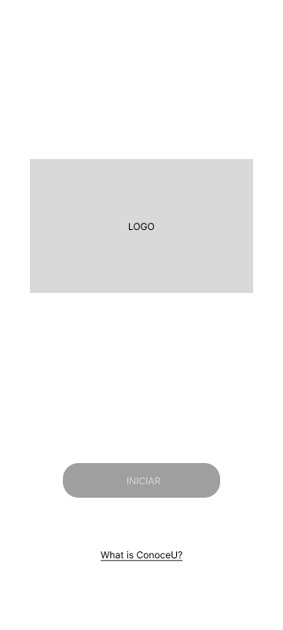
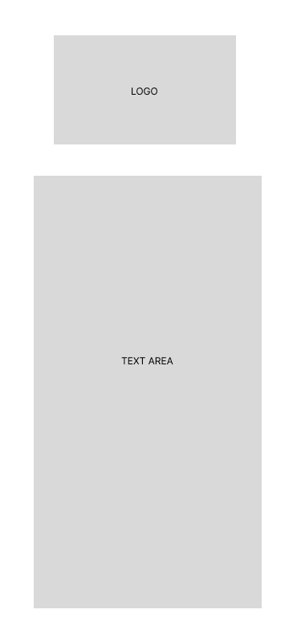

# Conoce U

## Overview
Conoce U is an application where UANL students will be able to see information about each of the careers in each faculty by reading a personalized QR code that will be located in each faculty. The information of each faculty will be displayed in AR. There will also be a section where students will be able to choose a faculty and the application will show them how to get to that faculty. This application will be made using Kotlin, Android Studio, Unity and Vuforia.

## Features

## Wireframes
|           |      |  |              |
|-----------------------------------------------|---------------------------------------------------|----------------------------------------------------|------------------------------------------------------|
|  |  |  |  |

## UI Design
|              |         |     |              |
|-----------------------------------------------|---------------------------------------------------|--------------------------------------------a--------|------------------------------------------------------|
|  |  |  |  |
## Screenshots

## Requirements

## Installation

## Usage

## Contribution

## Credits

## License
2023 Coderranza. All rights reserved.

## Contact
bryancarranza.works@gmail.com
Twitter: @coderranza
Linkedn: https://www.linkedin.com/in/bryancarranzar